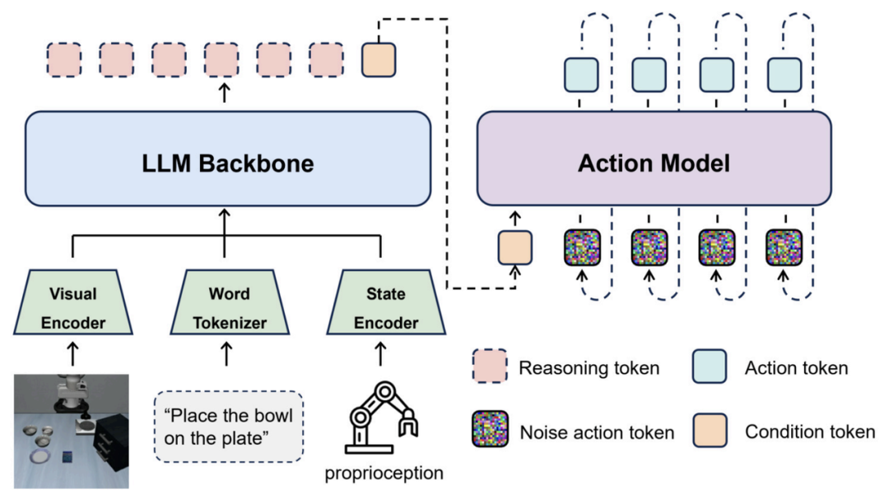
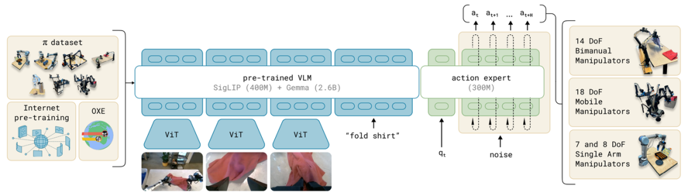
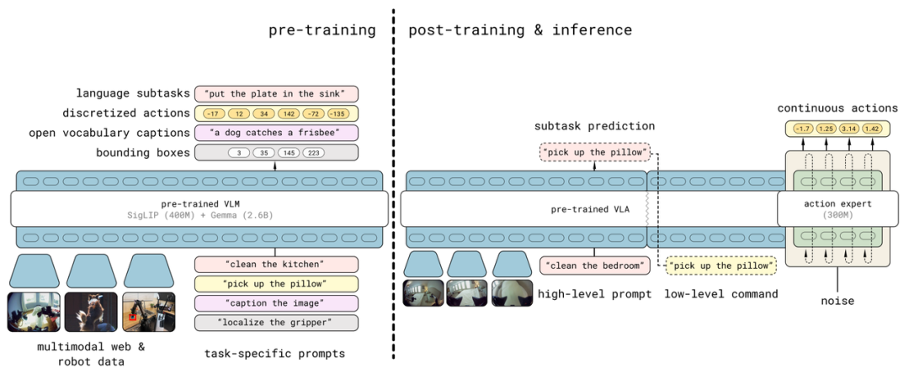
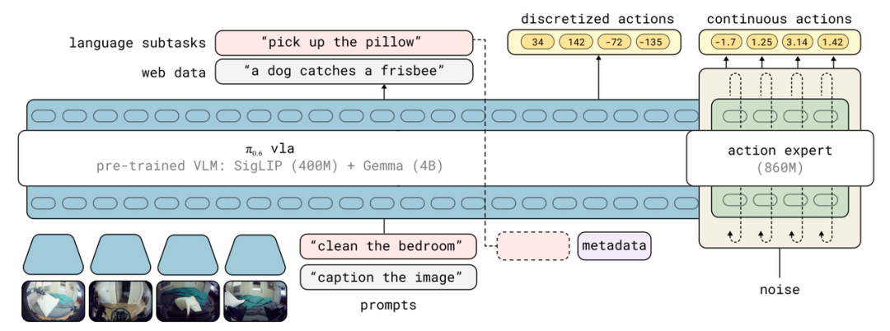
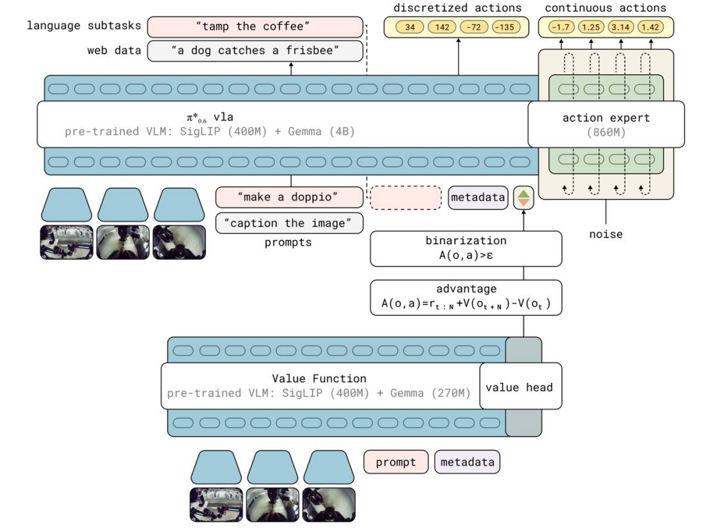
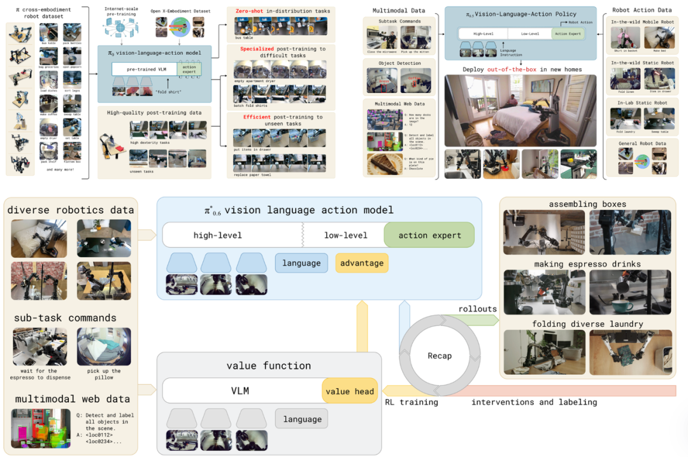

> 本文系统梳理 **Physical Intelligence（π 团队）** 开发的 π 系列 VLA 模型的技术演进路径，从 2024 年 10 月的 π0 到 2026 年 4 月的 π0.7，逐一拆解每个版本解决了什么核心问题、用了什么方法、效果如何。
>
> 本文与本站的 π 系列精读笔记互为补充：
> - [Flow Matching + VLM 架构详解](/posts/note-vlm/pi0-flow-matching-vlm/)
> - [π-FAST DCT+BPE](/posts/note-vlm/fast-dct-bpe/)

## 背景：为什么机器人需要"基础模型"？

在 LLM 出现之前，NLP 领域的范式是"一个任务训一个模型"——做情感分析的模型不能做机器翻译，做问答的模型不能做摘要。GPT 系列打破了这个范式：一个通用预训练模型 + 少量微调，征服了几乎所有下游任务。

机器人领域长期停留在"旧范式"里。一个焊接机器人不能去做分拣，一个分拣机器人不能去叠衣服。每换一个任务，就要重新采集数据、重新训练。这不仅昂贵，也从根本上制约了机器人的规模化应用。

Physical Intelligence 的核心目标就是：**为物理世界构建一个像 LLM 一样的基础模型**，让机器人像人一样，凭借通用经验快速适应新任务。这家公司由 Sergey Levine、Chelsea Finn、Karol Hausman 等顶级机器人学习研究者联合创立，2024 年获得超 4 亿美元融资、估值突破 20 亿美元，是具身智能赛道最受瞩目的玩家之一。

从 π0 到 π0.7，这条路他们走了不到两年。

## 一、VLA 模型基础架构范式

**视觉-语言-动作（VLA，Vision-Language-Action）模型**是具身智能的基础模型范式，核心思想是设计一个统一模型，直接将高维感知输入（视觉）和自然语言指令（语言）映射为低层机器人控制信号（动作），构建从感知到控制的端到端闭环。



*典型的 VLA 架构：视觉观测、文本指令和机器人本体感觉状态先被编码融合，再交给大语言模型推理，最终通过动作生成模型输出连续动作。*

三个组成部分：

- **视觉（Visual）**：机器人通过摄像头等传感器获取的外部世界信息，比如桌子上的物品、房间的布局。
- **语言（Language）**：机器人接收到的语言指令或描述，比如"把红色杯子放到桌子上"。
- **动作（Action）**：机器人根据视觉和语言执行的实际操作，比如移动手臂抓取杯子并放到指定位置。

但 VLA 模型天生要解决三个矛盾：

1. **语义理解 vs. 精确运动控制**：VLM 善于理解"叠衣服"是什么意思，但它输出的是离散 token，无法直接驱动关节电机；
2. **高频控制需求**：机器人需要每秒输出 50 次控制指令，LLM 那种慢速自回归推理根本跟不上；
3. **跨机器人泛化**：不同机械臂的关节数、运动范围、动力学特性各不相同，一个模型能否同时控制多种机器人？

π 系列的整个演进史，就是逐一攻克这三个矛盾的过程。

## 二、π0：第一个通用机器人基础模型（2024.10）

π0 是 π 系列的开山之作，也是 PI 团队推出的首个通用机器人基础模型。其核心技术突破在于把流匹配（Flow Matching）机制引入动作生成，解决了传统 VLM 难以输出高频、高精度连续动作的问题。

### 架构设计：VLM Backbone + Action Expert + Flow Matching

π0 的架构由两部分组成：

**① VLM Backbone（3B 参数）**：使用 Google 的 PaliGemma（3B）作为视觉语言主干，负责理解摄像头输入的图像、解析语言指令，提取高质量的语义表征。

**② Action Expert（动作专家，独立 Transformer）**：这是 π0 的核心创新。它是一个独立的小型 Transformer（约 3 亿参数），通过 Joint Attention 与 VLM Backbone 的表征交互，但拥有完全独立的参数集。它的输出是连续的关节角度动作，而不是离散 token。

**③ Flow Matching（流匹配）**：π0 没有用扩散模型（DDPM），而是用了更高效的流匹配——在动作空间中学习一个从噪声到动作的确定性流，路径是直线、速度恒定，推理时只需约 10 步去噪，远少于扩散模型的上百步，大幅降低延迟，满足 50Hz 高频控制需求。

这个设计的灵感来自 Transfusion 和 Stable Diffusion 3 的 mmDiT 结构：在同一个 Transformer 里同时处理离散 token（语言）和连续向量（动作），但通过参数分离保留各自的归纳偏置。

```text
输入：图像序列 [I_t¹...I_tᴺ] + 语言指令 ℓ
       ↓
VLM Backbone (PaliGemma 3B)
       ↓ Joint Attention ↓
Action Expert (小型 Transformer)
       ↓ Flow Matching
输出：连续动作块（Action Chunk）
```



*π0 框架：预训练数据（灵巧操作数据集 + 开源数据）训练流匹配 VLA 模型，由较大的 VLM 主干和较小的动作专家组成。*

### 训练数据与两阶段训练

训练数据来自两层：

- **Open X-Embodiment（OXE）** 开源跨机器人数据集；
- **π 内部数据集**：覆盖 8 种机器人平台（UR5e 单/双臂、Franka、Trossen 单/双臂、移动平台等）、68 个任务、超 10,000 小时操作演示数据。

训练采用**预训练 + 后训练**两阶段范式，这也是后来整个 π 系列的固定流程：

- **预训练**：在多机器人、多任务的大规模混合数据上训练，获得基础物理理解能力，零样本即可完成分布内任务；
- **后训练（Post-training）**：类比 LLM 的 RLHF，针对特定高难度任务（如叠衣服）收集高质量演示数据微调。实验表明，1~20 小时的数据即可将 π0 专精到新任务。

### 结果

在叠衣服、清理桌面等 5 项任务上，π0 以大幅优势超越当时最强的开源基线 OpenVLA 和 Octo——零样本（不做任何微调直接上场）在最难的烤面包任务上达到 0.75 分，叠衬衫任务直接满分 1.0，而 OpenVLA 和 Octo 在大部分困难任务上得分全是 0。

## 三、π0-FAST：自回归版本，强化语言理解（2025.02）

### 背景：FAST 动作分词器（2025.01）

传统 VLA 将关节角度离散化为固定 bin 再分配 token 编号，存在两个问题：

- **精度损失**：固定 bin 无法精确表示连续动作；
- **token 数量爆炸**：高频控制序列对应的 token 序列极长，训练效率低。

FAST 的做法是：对动作序列做 **DCT（离散余弦变换）**，把时域信号转成频域系数——平滑动作的能量高度集中在低频，用极少的系数就能精确描述；再用 **BPE（字节对编码）** 对这些系数分词。实验表明，FAST 让训练速度提升了 5 倍。

> 关于 FAST 的完整原理（DCT 四步详解、具体数字演算），见本站精读笔记：[π-FAST DCT+BPE](/posts/note-vlm/fast-dct-bpe/)

### π0-FAST 的设计

π0-FAST 用 FAST 分词器替代了 Flow Matching 动作头，整个模型变成**纯自回归架构**（类似 GPT）：VLM Backbone 直接预测 FAST 动作 token 序列，不再需要 Action Expert。

| 维度 | π0（Flow Matching） | π0-FAST（自回归） |
|---|---|---|
| 推理延迟 | 低（少量去噪步骤） | 高（约 4-5 倍慢） |
| 语言指令跟随 | 一般 | 更好 |
| 动作精度 | 高（连续输出） | 依赖分词精度 |
| 训练速度 | 标准 | 快 |

**选择建议**：任务需要精确语言理解选 π0-FAST；需要高频精确控制选 π0。

随开源同步发布的还有 π0-FAST DROID 和 π0 DROID 两个微调到 DROID 数据集的版本，首次实现了在全新环境中成功跟随指令执行任务。

## 四、π0.5：开放世界泛化（2025.04）

### 核心问题

π0 和当时其他所有 VLA 模型都有一个共同局限：测试环境必须和训练环境高度相似，一旦换了一个从未见过的厨房，模型就会"认不出来"，失效率大幅上升。

但真实世界的应用场景是无限多样的。要做到"拿来即用"，模型必须能泛化到任意新环境——不同的家具布局、不同品牌的餐具、从未出现过的对象类别。这就是**开放世界泛化（Open-World Generalization）**。

### 核心技术：异质数据联合训练（Co-training）

π0.5 的核心思路是通过联合训练多种异质数据，让模型同时学到物理技能、语义理解和场景泛化能力。训练数据由六类混合组成（缺少任何一类，性能都会显著下降）：

| 数据源 | 作用 |
|---|---|
| ① 移动操作数据 | 数十个不同家庭环境采集，泛化能力的核心来源 |
| ② 跨本体数据 | 来自 π0 训练集的多种机器人数据，理解物理操作共性 |
| ③ 多环境静态数据 | 多个家庭部署的单臂机器人数据，提升陌生场景指令跟随率 |
| ④ 多模态网页数据 | 图文问答、图像描述、检测数据，提升对未见过物品的语义识别 |
| ⑤ 高层语义标注 | 给观测加"下一步做什么"的语言标注，训练隐式任务规划 |
| ⑥ 口头指令演示 | 人类语音逐步指导，学会在长时程任务中响应实时指令 |

消融实验最能说明问题：π0.5 在分布外（OOD）任务中的任务跟随率和成功率达到 **94%**；去掉"多环境数据"后，这两个指标直接跌到 **33% 和 31%**。



*π0.5 两阶段训练：预训练结合多源数据生成初始 VLA（动作用 FAST 分词器表示为离散词元），后训练针对移动操作的高层与低层推理优化（动作用流匹配表示）。*

### 架构变化：分层推理

π0.5 的 VLM Backbone 不再只预测连续动作，而是**同时预测**：

- **高层语义输出**：下一个子任务是什么（"先想"）；
- **低层连续动作**：通过 Action Expert + Flow Matching 生成（"后做"）。

模型在同一个前向传播中完成"想清楚要干什么"和"动起来"两件事。这种"先想后做"的层次化设计，让长时程任务（如 10-15 分钟的清理厨房）的成功率大幅提升。此外还引入了 **RTC 实时分块技术**解决大模型推理延迟问题，以及**知识隔离**的雏形（下一节详解）。

当然 π0.5 仍有局限：成功率在新环境中不稳定、高层语义推理错误会传导到执行、电机命令精度在复杂操作中不足、数据依赖性强。

## 五、π-ego：人类视频迁移的涌现研究（2025.12）

### 核心问题：数据墙

机器人数据采集极其昂贵——需要专业操作员、实体机器人、大量时间。相比之下，人类第一视角视频（egocentric video）可以通过可穿戴相机轻松采集，数据量可以是机器人数据的数百倍。

但两者之间存在**领域鸿沟（Domain Gap）**：人手和机器人夹爪在外观和运动模式上差异巨大。过去的方法需要引入复杂的对齐机制——用分割遮掉人手、用生成模型把手"转换"成夹爪、使用仿人机器人对齐动作空间——要么破坏数据自然性，要么对硬件有特殊要求。

### 核心发现：规模涌现

π 的研究者用了一个极其简单的方法：**把人类视频当作另一种机器人本体来处理**，动作用 3D 手部位置表示，直接和机器人数据混合训练，不引入任何专门的迁移学习机制。

实验结果令研究者自己都感到惊讶：

- **小规模模型**：无法从人类视频中学习，把人手视为与夹爪无关的"陌生物体"；
- **π0.5 规模的模型**：使用相同的人类视频微调后，在泛化任务上取得约 **2 倍**的性能提升。

这是一种**涌现能力（Emergent Capability）**——只有当机器人预训练数据规模足够大、模型足够强时，模型内部才会自发形成"人类动作 ≈ 机器人动作"的潜在空间对齐。t-SNE 可视化证实了这一点：大模型中人类视频数据与机器人数据的表征在潜在空间里大量重叠，小模型中两者完全分离。

### 意义

这项发现从根本上改变了机器人数据采集的逻辑：如果"人类视频迁移"只需规模就能自发涌现，那么 YouTube、GoPro 视频都可能成为机器人训练数据，数据采集成本将从"数百万美元"量级降至"佩戴相机拍视频"量级。这也是 π0.7 后续整合人类数据的理论基础。

## 六、知识绝缘（KI）与 π0.6（2025.11）

### 前置技术：知识绝缘（Knowledge Insulation）

在 2025 年 5 月发布的研究报告 *"VLAs that Train Fast, Run Fast, and Generalize Better"* 中，π 深入分析了第二代 VLA 架构的核心缺陷：当在 VLM Backbone 上叠加 Action Expert 联合训练时，**Action Expert 的梯度会反向传播进 VLM Backbone**，导致：

- **训练速度变慢**：主干网络的表征被动作梯度破坏，需要更多迭代才能收敛；
- **语言理解退化**：VLM 对语言高度敏感的注意力机制被干扰，机器人开始忽视语言指令——实验中出现了"指令说拿勺子，机器人却去拿了垃圾"的失败案例。

一个形象的类比：给一位经验丰富的工程师（预训练 VLM）安排了一个强行干预他思路的实习生（Action Expert），结果工程师反而越干越差。

知识绝缘的解决方案是**双轨并行训练**：

```text
VLM Backbone (3B)
   ├─ 预测 FAST 离散动作 token（提供运动控制的表征学习信号）
   ├─ 预测语言输出（保持语言能力）
   ├─ 处理多模态网页数据（保持通用知识）
   └─── Stop Gradient ───────────────────┐
                                          ↓
                                   Action Expert (300M)
                                   预测连续动作（Flow Matching）
```

- VLM Backbone 用 FAST 离散 token 做运动相关表征学习，同时用网页数据和语言数据保住预训练知识——这条路的梯度正常流动；
- Action Expert 接收 VLM 表征，用 Flow Matching 生成连续动作——但它的梯度被 **Stop Gradient 截断，不流回主干网络**；
- 推理时，FAST 的离散动作预测被丢弃，只使用 Action Expert 输出的连续动作。

效果是同时实现了更快的训练收敛、更好的语言指令跟随（VLM 知识被完整保留）、更高质量的连续动作。

### π0.6：整合 KI 的下一代基础模型

π0.6 将知识绝缘架构作为标准训练范式，在 π0.5 的数据基础上重新训练，并对主干网络和提示设计做了针对性优化：

- 使用 **Gemma3 4B** 作为视觉-语言主干（动作专家约 8.6 亿参数）；
- 支持**多摄像头输入**（基础摄像头 + 两个腕部摄像头 + 可选后向摄像头），图像分辨率提升至 448×448；
- 通过**元数据条件调节**，模型能根据输入提示动态调整任务执行策略。



关键性能指标：

- 在单张 H100 上，**63ms** 完成 5 步去噪 + 3 路摄像头输入，输出一个动作块；
- 在叠衣服、整理床铺、洗碗、整理抽屉等 4 项移动操作任务上全面超越 π0.5；
- 支持在 prompt 中附加元数据改变执行策略，例如 `speed: fast` 或 `quality: high`；
- 能理解复杂的语言指令，如"从左边拿第三个水果""去新鲜牛奶存放的地方"，以及需要创造性理解的指令，如"用面包擦去溢出物""把短裤挂在烤箱把手上"。

## 七、π*0.6：RL 精调的专家模型（2025.11）

π*0.6 是 π0.6 的 RL 精调版本，核心突破是 **RECAP（基于优势条件策略的经验与纠偏强化学习）**方法，实现了机器人从自主经验中持续优化的能力。

RECAP 解决了传统 VLA 模型面临的两大难题：一是真实机器人数据极度异构，难以用标准策略梯度方法处理；二是流匹配等生成模型没有显式的 log π(a|s)，无法直接进行梯度更新。它采用**三阶段循环优化引擎**：

1. **经验收集**：让当前策略在真实世界中运行，收集成功与失败的完整轨迹，同时在智能体犯错时由人类专家提供纠正；
2. **价值函数训练**：使用极简的稀疏奖励（成功=0，失败=大负数，每一步=-1），训练分布式价值函数预测"负的剩余步数"，评估状态前景；
3. **策略更新**：基于优势（advantage）条件化策略，把原本需要 RL 求解的策略更新重新表述为监督学习问题，让模型高效吸收演示、自主成功、自主失败、人为干预等各类数据。



典型案例：让机器人**连续 13 小时自主制作意式浓缩咖啡**。通过 RL，机器人在实际执行中不断试错、获得奖励反馈，最终将成功率和吞吐量优化到远超模仿学习的水平。

代价也很明确：π0.6 是通用基础模型，π*0.6 是在此之上"卷死"特定任务的专家——**代价是失去通用性**。

## 八、π0.7：组合泛化，单模型打败所有 RL 专家（2026.04）

### 核心问题

π*0.6 的 RL 专家路线暴露了一个矛盾：每个新任务都要单独 RL 微调，规模化成本高。更深层的问题是：机器人基础模型能否像 LLM 一样做**组合泛化**——把已学过的技能重新组合，完成从未见过的任务，而不需要专门训练？

### 核心技术：多模态 Prompt 框架 + 世界模型子目标

π0.7 的答案不是更大的模型，而是**更丰富的训练信号**。

关键洞察：过去的训练数据只告诉模型"做什么"（任务指令），却没有告诉模型"怎么做"（策略细节）。不同操作者、不同质量水平的数据混在一起，模型学到的是"平均行为"，而非任意可控的行为。

π0.7 引入了**多模态 Prompt 结构**（训练时同时使用所有模态，测试时按需选择）：

| Prompt 类型 | 作用 | 示例 |
|---|---|---|
| 语言指令 | 描述任务目标 | "pick up the oven mitt" |
| 子步骤指令 | 分解长时程任务 | "open the drawer" → "place pot" → "close drawer" |
| 元数据 | 描述执行方式 | speed: fast, quality: high |
| 控制模态标签 | 区分关节控制 vs 末端控制 | control: joint / control: eef |
| 视觉子目标图像 | 指定每个子步骤结束时的视觉状态 | 一张桌面整洁的图片 |

**视觉子目标如何生成？** 测试时，一个轻量级**世界模型（World Model）**根据当前观测和任务指令预测"子步骤完成后的图像"，将其作为视觉子目标注入 π0.7 的 Prompt，为模型提供精确的空间约束。

**为什么多模态 Prompt 能实现组合泛化？** 核心逻辑：给不同质量、不同策略的数据附加对应的元数据标注后，模型可以把次优的自主失败数据也纳入训练（标注为低质量）而不会被"污染"。数据来源因此极大丰富——多种机器人本体的数据、人类第一视角视频（π-ego 的成果延续）、机器人自主执行的成功/失败数据。有了足够多样的数据，模型就能在潜在空间中建立技能的可组合表征，用已知技能的组合解决新问题。

### 核心结果

- **媲美 RL 专家**：单个 π0.7 通用模型在咖啡制作、装箱、叠衣服等任务上，达到甚至超过 RL 精调的 π*0.6 专家模型——而 π0.7 根本不需要针对这些任务单独微调；
- **零样本跨本体**：控制训练数据中几乎没有的双臂 UR5e 工业机械臂叠衣服（该平台没有任何叠衣数据），π0.7 能持续稳定完成；
- **组合泛化**：完成从未出现在训练数据中的任务组合，例如用新厨房用具完成熟悉任务的变体。

## 九、演进主线总结

```text
π0 (2024.10)
│  核心：VLM + Action Expert + Flow Matching
│  解决：如何让 VLM 驱动机器人做灵巧操作
│
├──> π0-FAST (2025.02)
│    核心：FAST 分词器 + 纯自回归架构
│    解决：更强的语言指令跟随，训练提速 5x
│
π0.5 (2025.04)
│  核心：多源异质数据联合训练（Co-training）
│  解决：如何泛化到从未见过的家庭环境
│
π-ego (2025.12)  [研究成果，非独立模型]
│  核心：发现人类视频迁移的涌现能力
│  解决：低成本数据来源，证明规模足够就能跨本体迁移
│
知识绝缘 KI (2025.05) [技术研究]
│  核心：Stop Gradient + FAST 双轨训练
│  解决：Action Expert 梯度污染 VLM Backbone 的问题
│
π0.6 (2025.11)
│  核心：整合 KI，架构全面升级
│  解决：训练更快、语言更准、推理 63ms
│
π*0.6 (2025.11)
│  核心：RECAP + RL 在线精调
│  解决：高精度重复性任务的极致优化（咖啡机、装配线）
│
π0.7 (2026.04)
   核心：多模态 Prompt + 世界模型子目标 + 多源数据统一
   解决：组合泛化——无需针对新任务训练，靠重组已有技能解决新问题
```

| 版本 | 时间 | 关键技术 | 解决的核心问题 |
|---|---|---|---|
| π0 | 2024.10 | Flow Matching + Action Expert + PaliGemma | VLM 驱动连续动作控制 |
| π0-FAST | 2025.02 | FAST 分词器 + 自回归 VLA | 语言跟随 & 训练效率 |
| π0.5 | 2025.04 | 多源联合训练 + 高层语义预测 | 开放世界泛化 |
| π-ego | 2025.12 | 涌现式人-机迁移 | 低成本数据来源 |
| π0.6 | 2025.11 | 知识绝缘（Stop Gradient + FAST 双轨） | 训练稳定性 & 语言理解 |
| π*0.6 | 2025.11 | RECAP + RL 在线精调 | 高精度专项任务极致优化 |
| π0.7 | 2026.04 | 多模态 Prompt + World Model 子目标 | 组合泛化，单模型通杀 |



## 写在最后

π 系列的演进可以浓缩成一句话：**先让机器人"能做更多事"，再让它"把事越做越好"**——先用大规模跨机器人数据教会机器人「会干活」，再用异构同训让它「看懂局」，最后把它丢回现实世界，通过纠错和自我练级，慢慢长成一个 Embodied Agent。

Physical Intelligence 的进化路径，本质上是在不断回答同一个问题：**怎样用更少的专项数据，让机器人做更多的事？**

从 π0 证明"通用预训练有效"，到 π0.5 证明"多样数据能泛化新场景"，到 π-ego 证明"人类视频可以免费使用"，再到 π0.7 证明"技能可以像 LLM 一样组合"——每一步都在扩大机器人智能的边界。这条技术路线也已被广泛采纳：埃斯顿酷卓 Codroid 02、英伟达 GR00T N1、Figure AI 的 Helix 等，均采用类似的双系统架构。

距离"让机器人像人一样灵活处理任何任务"，他们还有很长的路要走。但这条路的方向，已经越来越清晰了。

## 参考论文

- π0: *A Vision-Language-Action Flow Model for General Robot Control*（2024.10）— https://arxiv.org/pdf/2410.24164
- π0.5: *A Vision-Language-Action Model with Open-World Generalization*（2025.04）— https://arxiv.org/pdf/2504.16054
- π*(0.6): *A VLA That Learns From Experience*（2025.11）— https://arxiv.org/pdf/2511.14759v2

> 本文为「从零走向 AGI」学习项目系列内容之一：[From-Zero-to-AGI](https://github.com/AI-mzq/From-Zero-to-AGI)
